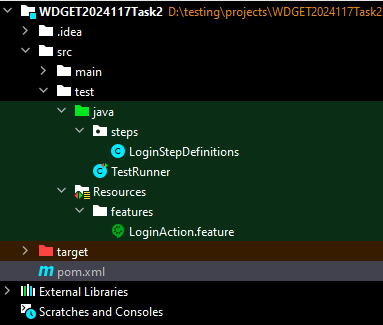
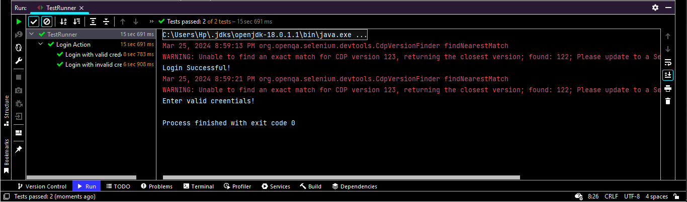

# Cucumber Test Project: Login Action

## Overview
This project contains automated tests for the login functionality of a web application using Cucumber, Selenium, and JUnit. The tests are written in Gherkin language in feature files, and the step definitions are implemented in Java.

## Prerequisites
- Java Development Kit (JDK) installed on your system
- Maven build tool installed on your system
- WebDriver executable (e.g., ChromeDriver) compatible with your browser version

## Getting Started
1. Clone this repository to your local machine.
2. Ensure that all prerequisites are met.
3. Run the `TestRunner` class to execute the Cucumber tests.

## Project Structure

- `src/test/Resources/features`: Contains Gherkin feature files describing test scenarios.
- `src/test/java/steps`: Contains Java classes with step definitions for the scenarios defined in feature files.
- `src/test/java/TestRunner.java`: Contains the test runner class that configures and executes the Cucumber tests.
- `pom.xml`: Maven project configuration file specifying project dependencies and build settings.

## Running Tests
To run the automated tests, follow these steps:
1. Navigate to the project directory in the terminal.
2. Run the following command: `mvn test`
3. The tests will be executed, and the results will be displayed in the console.

## Test Results

After running the tests, you can view the test results in the console. Assertions and verifications are performed within the step definitions to validate the behavior of the application under test.

## Dependencies
- Cucumber: BDD framework for writing feature files and step definitions.
- Selenium WebDriver: Automation tool for interacting with web elements.
- JUnit: Unit testing framework for executing the Cucumber tests.

